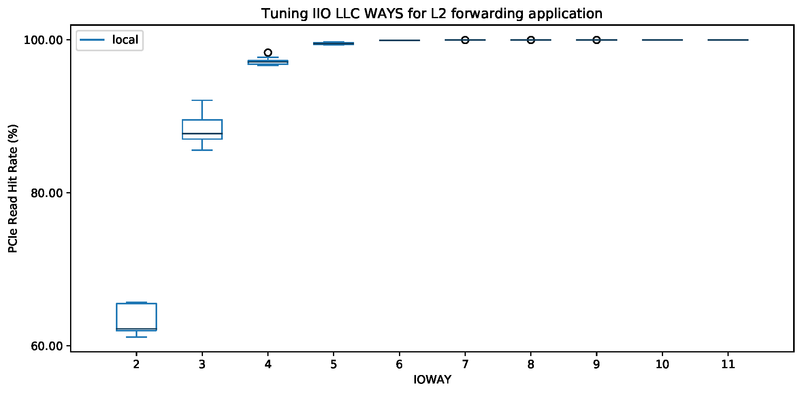

# DDIOTune Experiment

This experiment reproduces the results presented in Section 4.4 of [our paper][ddio-atc-paper]. The goal is to see the impact of tuning `IIO LLC WAYS` registers on the performance of DDIO (i.e., PCIe read/write hit rate).

`make run` runs these experiments. NPF automatically generates the output as CSVs and PDFs.

The output of the experiment should be similar to the following figure:

2 and 11 are representing the minimum and maximum values for `IIO LLC WAYS` that are `0x600` and `0x7FF` in our testbed, respectively.

[ddio-atc-paper]: https://www.usenix.org/conference/atc20/presentation/farshin
