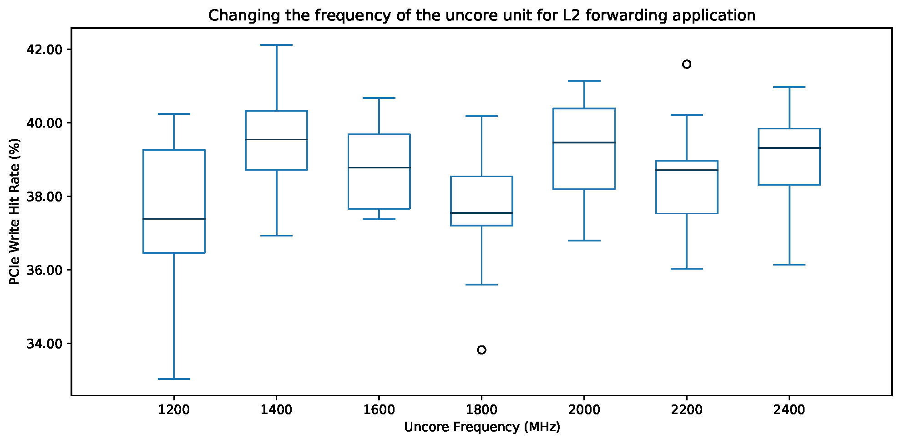

# Frequency Experiment

This experiment measures the performance of DDIO (i.e., PCIe read/write hit rate) while changing the uncore frequency.

`make run` runs these experiments. NPF automatically generates the output as CSVs and PDFs.

The output of the experiment should be similar to the following figure:



**Note that this experiment is not included in [our paper][ddio-atc-paper].**

## Uncore Frequency Scaling (UFS)

It is possible to change the uncore frequency by tuning `UNCORE_RATIO_LIMIT` register located at `0x620`. The value of this register is a 16-bit hexadecimal number. Bits 15-8 show the minimum frequency while bits 7-0 show the maximum frequency. After converting the values to decimal, you should multiply it by 100 MHz.

**The default value of `MSR 0x620` shows the frequency range of the CPU. In our Skylake testbed, the default value is 0xc18, i.e., the minimum frequency is (0xc=12 * 100 MHz = 1.2 GHz) and the maximum frequency is (0x18=24 x 100 MHz = 2.4 GHz).**

You can change the frequency by setting both min/max to the same value. Setting the value to `0x3f3f` will maximize the uncore frequency.

```bash
sudo wrmsr 0x620 0x3f3f
```

You can check the current uncore frequency by reading the value of a register located at `0x621`.

```bash
sudo rdmsr 0x621
```

For more information, please check [here][intel-book].

[ddio-atc-paper]: https://www.usenix.org/conference/atc20/presentation/farshin
[intel-book]: https://link.springer.com/book/10.1007/978-1-4302-6638-9
