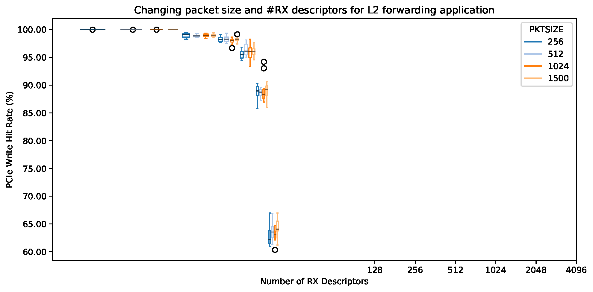

# Packet Size and RX Descriptors Experiment

This experiment reproduces the results presented in Section 5.1 of [our paper][ddio-atc-paper]. The goal is to measure the performance of DDIO (i.e., PCIe read/write hit rate) while forwarding different packet sizes at maximal rate with different number of RX descriptors.

`make run` runs these experiments. NPF automatically generates the output as CSVs and PDFs.

The output of the experiment should be similar to the following figure:

[ddio-atc-paper]: https://www.usenix.org/conference/atc20/presentation/farshin
