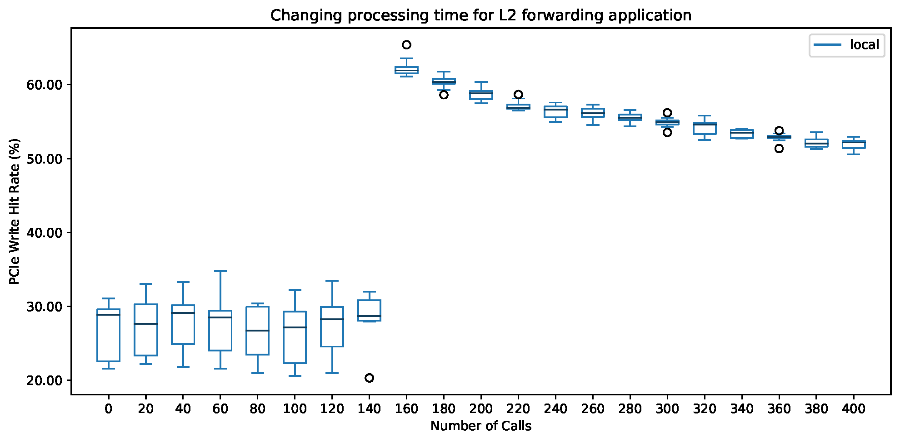
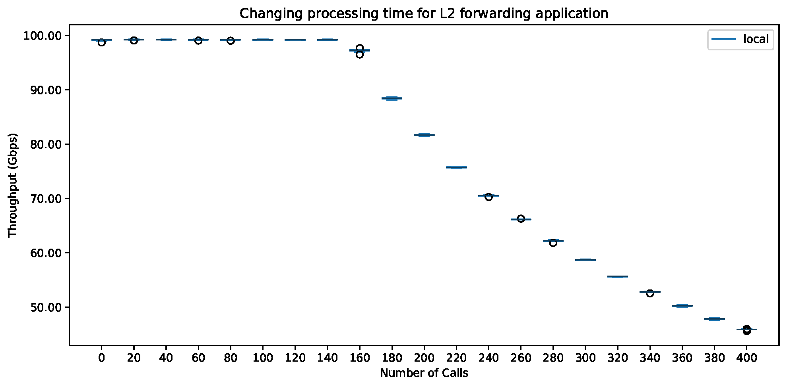

# Processing Time Experiment

This experiment reproduces the results presented in Section 5.2 of [our paper][ddio-atc-paper]. The goal is to measure the performance of DDIO (i.e., PCIe read/write hit rate) while processing packets. We use Fastclick's `WorkPackage` element to vary the amount of computation per packet by calling the `std::mt1993` random number generator multiple times, see [here][workpackage-wiki].

`make run` runs these experiments. NPF automatically generates the output as CSVs and PDFs.

The output of the experiment should be similar to the following figures:

**Note that these figures are a stretched version of the figures used in our paper, as DUT's processor is running at a higher frequency.**

[ddio-atc-paper]: https://www.usenix.org/conference/atc20/presentation/farshin
[workpackage-wiki]: https://github.com/tbarbette/fastclick/wiki/WorkPackage
